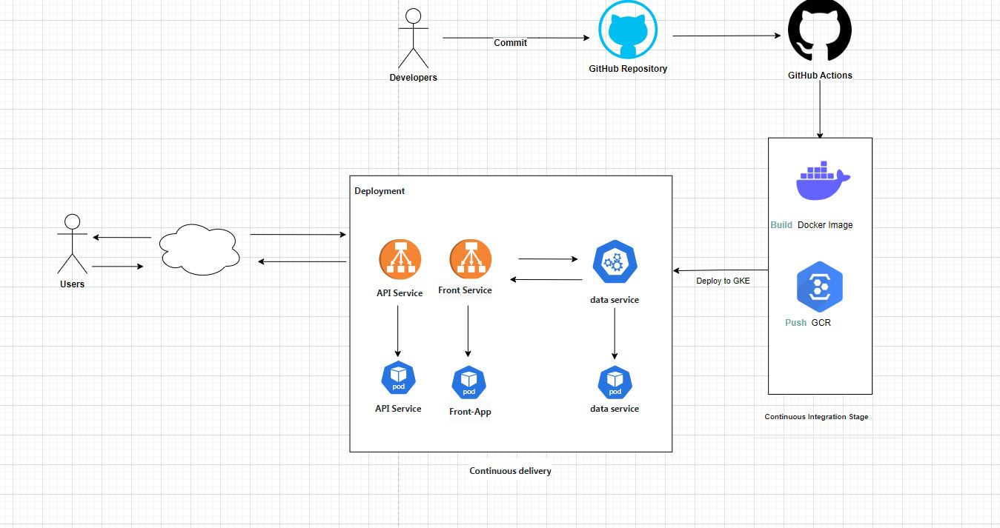

# k8sIsFun Project

Welcome to the k8sisfun project! This repository is part of a larger project.

## Repositories

- [API Service Repository](https://github.com/Nivrin/k8sIsFun-APIService)
- [Data Service Repository](https://github.com/Nivrin/k8sIsFun-DataService)
- [Simple Front Repository](https://github.com/Nivrin/k8sIsFun-SimpleFront)

## Architecture



# Data Service Documentation

Welcome to the documentation for my data service, which provides endpoints for retrieving state codes and names.

## Overview

The data service is a Flask application that serves state codes and names. It exposes two endpoints: one for retrieving state codes and another for retrieving state names. These endpoints are accessible over HTTP.

## Endpoints

- **GET /codes**: Returns a JSON object containing state codes and their corresponding names.
- **GET /states**: Returns a JSON object containing state names and their corresponding codes.

## Usage

To access the data service, you can send HTTP requests to the appropriate endpoint:

- **GET /codes**: Retrieve state codes and names.
  Example: `curl http://<data_service_url>/codes`
- **GET /states**: Retrieve state names and codes.
  Example: `curl http://<data_service_url>/states`

## Deployment

To deploy the data service, follow these steps:

1. Clone the repository:

    ```bash
    git clone <repository_url>
    ```

2. Navigate to the project directory:

    ```bash
    cd <project_directory>
    ```
    
3. Build the Docker image:

    ```bash
    docker build -t gcr.io/${PROJECT_ID}/data_service:v1 .
    ```
4. push the Docker image:

    ```bash
    docker push gcr.io/${PROJECT_ID}/data_service:v1
    ```
 5. Create a container cluster (if you haven't already done so)
   ```bash
    gcloud container clusters create <name> --num-nodes=1 
    ```
6. Apply the Kubernetes service configuration:

    ```bash
    kubectl apply -f manifests/data_service-service.yaml
    ```

7. Apply the Kubernetes deployment configuration:

    ```bash
    kubectl apply -f manifests/data_service-deployment.yaml
    ```

## Continuous Integration/Continuous Deployment (CI/CD)

We use GitHub Actions for CI/CD. The workflow defined in the `google.yml` file automates the building, publishing, and deploying processes.

